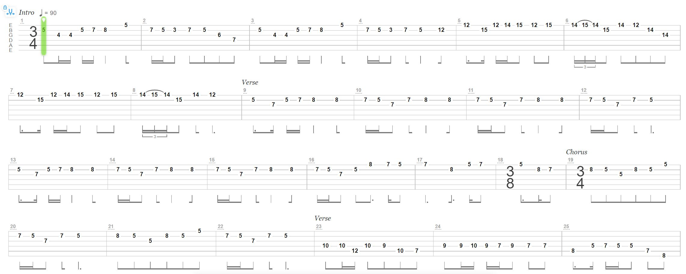

# Guitar Tab To Piano Sheet Converter

## Motivation & Purpose
This is a project that converts guitar tabs with multiple instruments into a single piano sheet music document.  
Also generates midi piano files for guitar tabs.
As a piano player who loves listening to metal, certain songs only had guitar tabs, but no piano sheets music.   
So what I'm saying is yes, the whole project happened because I wanted to play Blind Guardian on the piano 

## Results
### Example Sheet Music
Piano sheet music generated automatically via an algorithm to process guitar tabs:

<td>

<table>
  <tr>
    <td> Guitar Tabs [Before] </td>
    <td>Piano Sheets [After]</td>
   </tr> 
  <tr>
    <td width="60%"> </td>
    <td>
        
        
    </td>
   </tr> 
</table>

[Click here to see full piano sheet pdf](/media/sheet_music_results/Skalds%20and%20Shadows%20PIano%20Sheet%20Music.pdf)

### Example Visualized Midi 

## How to Run
something